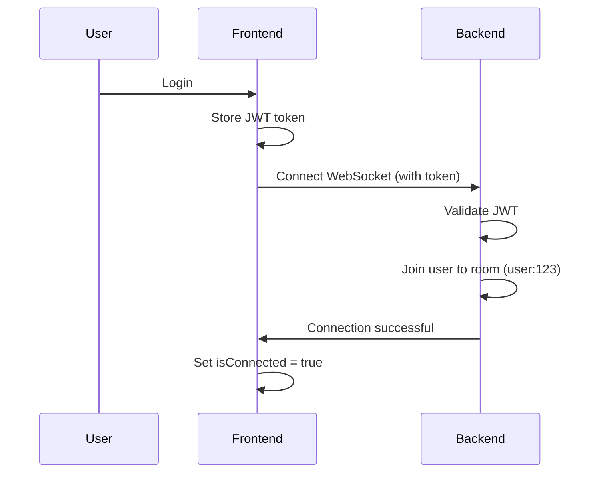
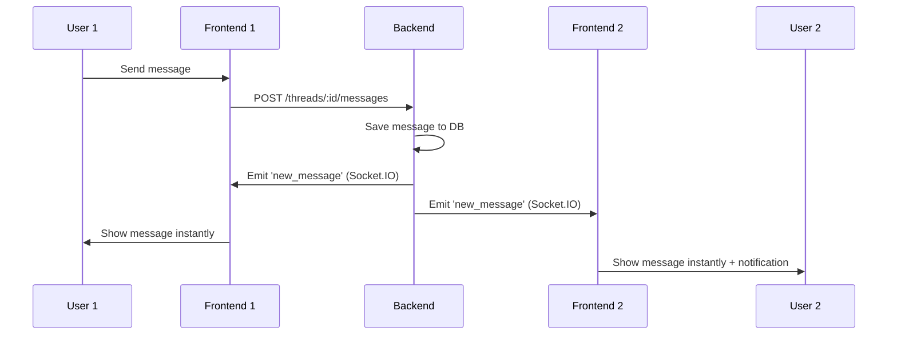

# WebSocket Real-Time Messaging - Implementation Guide

## 📚 Documentation Overview

This project uses Socket.IO for real-time messaging between users. Below are the complete implementation guides for both frontend and backend.

---

## 🗂️ Available Guides

### 1. **Backend Implementation Guide**

📄 **File:** [`WEBSOCKET_BACKEND_IMPLEMENTATION.md`](./WEBSOCKET_BACKEND_IMPLEMENTATION.md)

**For:** Backend developers  
**Technology:** Socket.IO with NestJS  
**Contains:**

- Socket.IO server setup
- JWT authentication for WebSocket connections
- User room management
- Event broadcasting (`new_message`, `message_read`, `thread_update`)
- Complete code examples
- Testing instructions

### 2. **Frontend Integration Guide**

📄 **File:** [`FRONTEND_WEBSOCKET_GUIDE.md`](./FRONTEND_WEBSOCKET_GUIDE.md)

**For:** Frontend developers  
**Technology:** Socket.IO Client with Vue 3 + Pinia  
**Contains:**

- Socket.IO client installation and setup
- WebSocket service creation
- Chat store (Pinia) implementation
- Complete Vue components
- Real-time event handling
- Testing checklist

---

## 🚀 Quick Start

### Backend Setup

```bash
# 1. Install dependencies
npm install socket.io @nestjs/websockets @nestjs/platform-socket.io

# 2. Follow WEBSOCKET_BACKEND_IMPLEMENTATION.md
# 3. Run backend server
npm run start:dev
```

### Frontend Setup

```bash
# 1. Install Socket.IO client
cd lendit-frontend
npm install socket.io-client

# 2. Already implemented! ✅
# - websocketService.js
# - chat.js store
# - App.vue integration

# 3. Run frontend
npm run dev
```

---

## 🔄 Current Implementation Status

### ✅ Frontend (Complete)

- [x] Socket.IO client installed
- [x] `websocketService.js` - Connection management
- [x] `chat.js` - Pinia store with event handlers
- [x] `App.vue` - Lifecycle management
- [x] `main.js` - Initial connection on auth
- [x] `Messages.vue` - Chat UI
- [x] Real-time message handling
- [x] Unread badge updates
- [x] Auto-reconnection logic

### ⏳ Backend (Pending)

- [ ] Socket.IO server setup
- [ ] JWT authentication for WebSocket
- [ ] User room management
- [ ] Broadcast `new_message` event
- [ ] Broadcast `message_read` event
- [ ] Broadcast `thread_update` event
- [ ] CORS configuration
- [ ] Testing

---

## 📡 How It Works

### Connection Flow



### Message Flow



---

## 🎯 Event Types

### 1. `new_message`

**When:** A new message is created  
**Sent to:** Both thread participants  
**Payload:**

```typescript
{
  type: 'new_message',
  threadId: string,
  message: {
    id: string,
    senderId: string,
    sender: { id, username, email },
    type: 'TEXT' | 'IMAGE',
    text: string,
    imageUrl?: string,
    readAt: string | null,
    createdAt: string
  }
}
```

### 2. `message_read`

**When:** Messages are marked as read  
**Sent to:** Message sender  
**Payload:**

```typescript
{
  type: 'message_read',
  threadId: string,
  messageIds: string[],
  readBy: string,
  readAt: string
}
```

### 3. `thread_update`

**When:** Thread metadata changes  
**Sent to:** Relevant user  
**Payload:**

```typescript
{
  type: 'thread_update',
  threadId: string,
  unreadCount: number,
  lastMessage?: {
    text: string,
    createdAt: string
  }
}
```

---

## 🧪 Testing

### Manual Testing

1. **Open two browser windows/tabs**
2. **Login as different users in each**
3. **Open Messages view**
4. **Send message from User 1**
5. **✅ Verify message appears instantly on User 2's screen**
6. **✅ Verify unread badge updates**
7. **Open message on User 2's side**
8. **✅ Verify read receipt shows on User 1's screen**

### Browser Console Testing

```javascript
// Check connection status
console.log("WebSocket connected:", chatStore.isConnected);

// Check total unread messages
console.log("Unread count:", chatStore.totalUnreadCount);

// Listen for events
const socket = getSocket();
socket.on("new_message", (data) => console.log("New message:", data));
socket.on("message_read", (data) => console.log("Read:", data));
socket.on("thread_update", (data) => console.log("Update:", data));
```

---

## 🐛 Troubleshooting

### Frontend Shows "Disconnected"

**Check:**

1. Backend Socket.IO server is running
2. Backend is on `http://localhost:4000`
3. JWT token is valid (not expired)
4. Browser console for connection errors

### Messages Not Appearing in Real-Time

**Check:**

1. WebSocket connection is established (green indicator)
2. Backend emits events after saving messages
3. Event names match (`new_message`, not `newMessage`)
4. User is in the correct room

### "CORS Error"

**Backend Fix:**

```typescript
@WebSocketGateway({
  cors: {
    origin: 'http://localhost:3000',
    credentials: true,
  },
})
```

### "Invalid Token" / Connection Rejected

**Check:**

1. Token is passed correctly: `query: { token }`
2. Backend validates token from `client.handshake.query.token`
3. Token is not expired
4. JWT secret matches

---

## 📦 Dependencies

### Frontend

```json
{
  "socket.io-client": "^4.x.x",
  "vue": "^3.x.x",
  "pinia": "^2.x.x"
}
```

### Backend

```json
{
  "socket.io": "^4.x.x",
  "@nestjs/websockets": "^10.x.x",
  "@nestjs/platform-socket.io": "^10.x.x",
  "@nestjs/jwt": "^10.x.x"
}
```

---

## 🌐 Environment Variables

### Frontend (`.env` or `.env.local`)

```bash
VITE_API_BASE_URL=http://localhost:4000
VITE_WS_URL=http://localhost:4000
```

### Backend (`.env`)

```bash
WS_PORT=4000
FRONTEND_URL=http://localhost:3000
JWT_SECRET=your-secret-key
JWT_EXPIRES_IN=7d
```

---

## 📖 Additional Resources

- [Socket.IO Documentation](https://socket.io/docs/v4/)
- [Socket.IO Client API](https://socket.io/docs/v4/client-api/)
- [NestJS WebSockets](https://docs.nestjs.com/websockets/gateways)
- [Vue 3 Composition API](https://vuejs.org/guide/extras/composition-api-faq.html)
- [Pinia Store](https://pinia.vuejs.org/)

---

## 🎉 Summary

### What's Working (Frontend)

✅ Socket.IO client installed and configured  
✅ WebSocket service with auto-reconnection  
✅ Chat store with event handling  
✅ Real-time message updates  
✅ Unread badge updates  
✅ Connection status indicator  
✅ Beautiful chat UI

### What's Needed (Backend)

⏳ Socket.IO server implementation  
⏳ JWT authentication for connections  
⏳ Event broadcasting on message actions  
⏳ Room management for users

---

## 📞 Support

If you have questions or encounter issues:

1. Check the relevant guide (`WEBSOCKET_BACKEND_IMPLEMENTATION.md` or `FRONTEND_WEBSOCKET_GUIDE.md`)
2. Check browser console for errors
3. Check backend logs for WebSocket connection attempts
4. Verify JWT token is valid and not expired

---

**🚀 Let's build amazing real-time messaging!**
