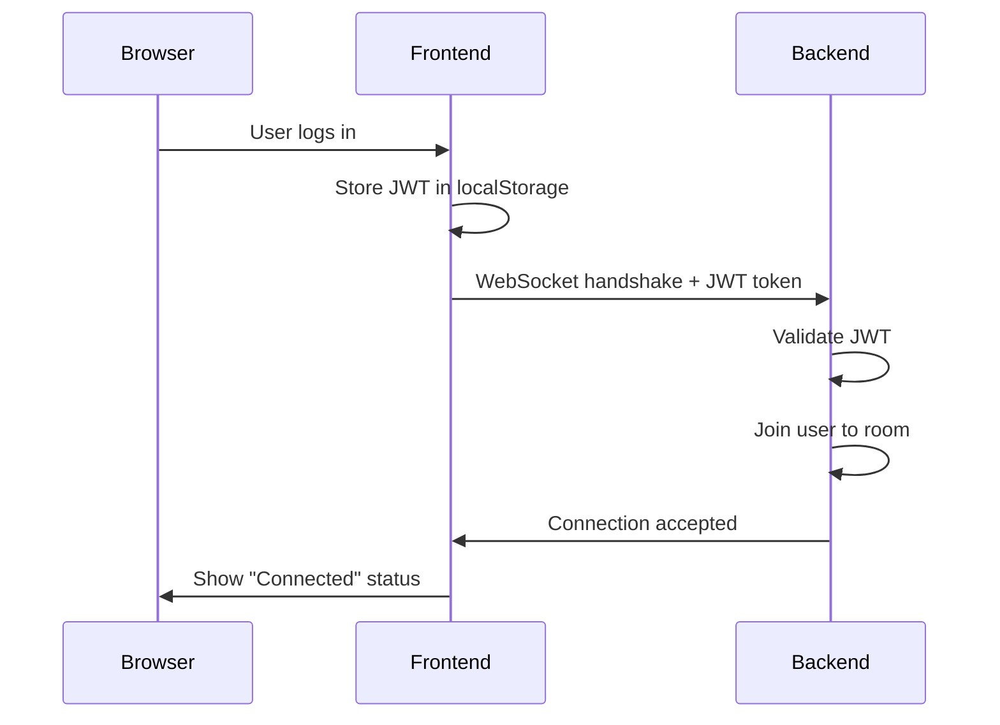

# WebSocket Connection Testing Tools

## 🧪 Overview

This directory contains tools to help you test and debug WebSocket connections.

---

## 📋 Available Tools

### 1. **HTML Test Tool** (Recommended)

📄 **File:** `test-websocket.html`

**Features:**

- ✅ Visual interface with real-time logging
- ✅ Auto-fill token from localStorage
- ✅ Token validation and cleaning
- ✅ Connection status indicator
- ✅ Detailed error messages
- ✅ Works standalone (no build required)

**How to Use:**

1. Open `test-websocket.html` in your browser
2. Click "Auto-fill from localStorage" (or paste token manually)
3. Click "Test Connection"
4. Watch the logs for connection status

**URL:**

```
file:///path/to/lendit-frontend/test-websocket.html
```

---

### 2. **Console Test Script**

📄 **File:** `test-websocket-console.js`

**Features:**

- ✅ Runs directly in browser console
- ✅ Auto-loads Socket.IO if needed
- ✅ Detailed step-by-step logging
- ✅ Token decoding and validation
- ✅ Expiration checking
- ✅ Troubleshooting guide

**How to Use:**

**Option A: Copy & Paste**

1. Open browser DevTools (F12)
2. Go to Console tab
3. Copy entire contents of `test-websocket-console.js`
4. Paste into console
5. Press Enter

**Option B: Load as Script**

```javascript
// In browser console
const script = document.createElement("script");
script.src = "/test-websocket-console.js";
document.head.appendChild(script);
```

---

## 🎯 What Each Tool Tests

### Connection Test

1. ✅ **Token Retrieval** - Gets token from localStorage
2. ✅ **Token Cleaning** - Removes "Bearer " prefix
3. ✅ **Token Validation** - Checks JWT format (3 parts)
4. ✅ **Token Expiration** - Verifies token hasn't expired
5. ✅ **Backend Connection** - Attempts WebSocket connection
6. ✅ **Authentication** - Tests JWT validation on backend
7. ✅ **Event Listening** - Listens for real-time events

---

## 📊 Understanding Test Results

### ✅ Success

```
🎉 SUCCESS! WebSocket Connected
✅ Socket ID: abc123xyz
✅ Connected to: http://localhost:4000
✅ Transport: websocket
```

**What this means:**

- Backend is running
- Token is valid
- WebSocket connection established
- Ready for real-time messaging

**Next Steps:**

- Test sending messages in the app
- Open another browser tab to test real-time updates
- Verify events are received

---

### ❌ Common Errors

#### 1. Backend Not Running

```
❌ CONNECTION FAILED
Error: xhr poll error
```

**Problem:** Backend server is not responding

**Solutions:**

```bash
# Start backend server
cd backend
npm run start:dev

# Check if running
curl http://localhost:4000/health
```

---

#### 2. Invalid Token

```
❌ CONNECTION FAILED
Error: websocket error
Token validation failed
```

**Problem:** Token is invalid or expired

**Solutions:**

1. Log in again to get fresh token
2. Check token format (should have 3 parts: `xxx.yyy.zzz`)
3. Verify JWT secret matches on backend
4. Check token expiration date

---

#### 3. CORS Error

```
❌ CONNECTION FAILED
Error: CORS blocked
```

**Problem:** Backend CORS configuration

**Solution (Backend):**

```typescript
@WebSocketGateway({
  cors: {
    origin: 'http://localhost:3000',
    credentials: true,
  },
})
```

---

#### 4. Connection Timeout

```
⏱️ Connection attempt timed out after 10 seconds
```

**Problem:** Backend is slow or unreachable

**Solutions:**

1. Check backend logs for errors
2. Verify backend URL is correct
3. Check firewall/network settings
4. Increase timeout if backend is slow

---

## 🔍 Debugging Tips

### Check Token in Console

```javascript
// Get token
const token = localStorage.getItem("access_token");
console.log("Token:", token);

// Check format
console.log("Parts:", token.split(".").length); // Should be 3

// Decode payload (for info only)
const payload = JSON.parse(atob(token.split(".")[1]));
console.log("Payload:", payload);
console.log("Expires:", new Date(payload.exp * 1000));
```

### Check Backend Status

```bash
# Test HTTP endpoint
curl http://localhost:4000/health

# Check backend logs
# Look for "WebSocket" or "Socket.IO" logs
```

### Check Network in DevTools

1. Open DevTools (F12)
2. Go to Network tab
3. Filter: `WS` (WebSocket)
4. Try connecting
5. Check for WebSocket upgrade request
6. Look at request/response headers

---

## 🧰 Manual Testing

### Test Socket.IO Connection Manually

```javascript
// Load Socket.IO
const script = document.createElement("script");
script.src = "https://cdn.socket.io/4.7.2/socket.io.min.js";
document.head.appendChild(script);

// After Socket.IO loads...
const token = localStorage
  .getItem("access_token")
  ?.replace("Bearer ", "")
  .trim();

const socket = io("http://localhost:4000", {
  auth: { token },
  query: { token },
  transports: ["websocket", "polling"],
});

socket.on("connect", () => {
  console.log("✅ Connected:", socket.id);
});

socket.on("connect_error", (error) => {
  console.error("❌ Error:", error.message);
});

// Listen for events
socket.on("new_message", (data) => {
  console.log("📨 New message:", data);
});

socket.on("message_read", (data) => {
  console.log("👁️ Message read:", data);
});

socket.on("thread_update", (data) => {
  console.log("🔄 Thread update:", data);
});
```

---

## 📝 Test Checklist

Before opening a bug report, verify:

- [ ] Backend server is running on http://localhost:4000
- [ ] You're logged in and have a valid token
- [ ] Token is stored in localStorage as `access_token`
- [ ] Token format is valid (3 parts separated by dots)
- [ ] Token hasn't expired
- [ ] Backend Socket.IO gateway is configured
- [ ] CORS is enabled for http://localhost:3000
- [ ] No firewall blocking WebSocket connections
- [ ] Browser console shows no CORS errors
- [ ] Backend logs show no JWT validation errors

---

## 🎓 How WebSocket Connection Works



---

## 📞 Still Having Issues?

1. **Check backend logs** - Look for WebSocket/Socket.IO errors
2. **Check browser console** - Look for JavaScript errors
3. **Check network tab** - Look for failed WebSocket requests
4. **Compare with docs** - See `WEBSOCKET_BACKEND_IMPLEMENTATION.md`
5. **Ask for help** - Include logs from both tools above

---

## 🔗 Related Documentation

- **Backend Guide:** `../WEBSOCKET_BACKEND_IMPLEMENTATION.md`
- **Frontend Guide:** `../FRONTEND_WEBSOCKET_GUIDE.md`
- **Overview:** `../WEBSOCKET_IMPLEMENTATION_README.md`

---

**Good luck testing! 🚀**
